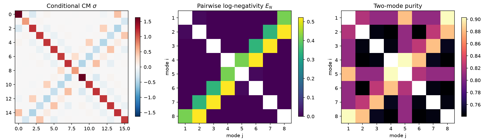
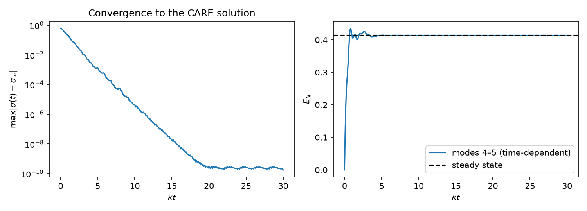
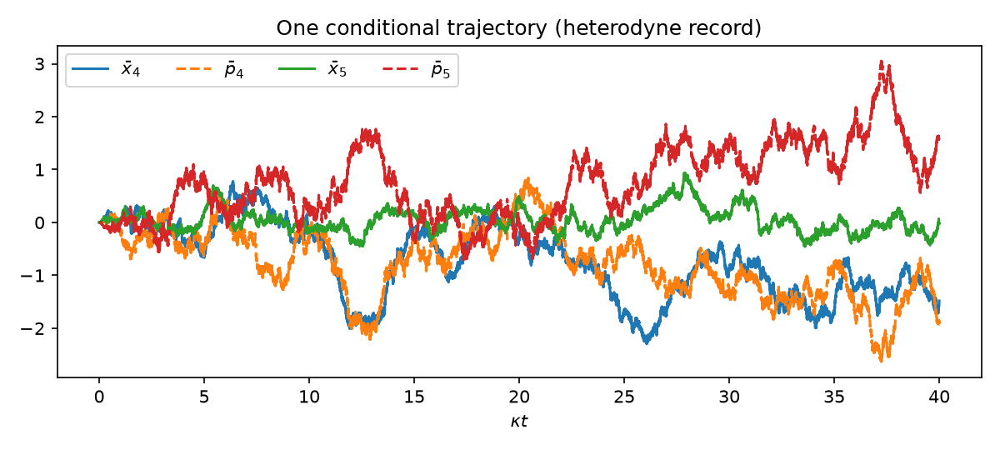

# Solving the Gaussian stochastic master equation

This note explains what `gaussian_sme.ipynb` computes and why it works.

## 1. Setting

We have $N$ bosonic modes with quadratures in interleaved order

$$
\hat r=(\hat x_1,\hat p_1,\dots,\hat x_N,\hat p_N)^T,\qquad
\hat x=\hat a+\hat a^\dagger,\quad \hat p=i(\hat a^\dagger-\hat a),\qquad
[\hat r_j,\hat r_k]=2i\Omega_{jk},
$$

with $\Omega=\bigoplus_{j=1}^N\begin{pmatrix}0&1\\-1&0\end{pmatrix}$. In this convention the
vacuum covariance matrix is $\sigma=\mathbb 1$.

The system has three parts:

| ingredient | matrix | in the example |
|---|---|---|
| Hamiltonian $\hat H=\tfrac12\hat r^TH\hat r$ | $H$ (real symmetric) | two-mode squeezing on graph edges + all-pairs beam splitter |
| linear coupling to Markovian baths | $C$, bath CM $\sigma_{\rm in}$ | $C=\bigoplus_j\sqrt{\kappa_j}\,\Omega_1^T$, $\sigma_{\rm in}=(2n_{\rm th}+1)\mathbb 1$ |
| continuous general-dyne detection of each output | measurement CM $\sigma_m$ | heterodyne, $\sigma_m=\mathbb 1$ |

The two-mode-squeezing Hamiltonian is built from a complex, symmetric adjacency matrix
$\mathcal A$ through $H=K\,(i\mathcal A\oplus -i\mathcal A^*)\,K^T/2$, where $K$ maps
$(\hat a_1,\dots,\hat a_N,\hat a_1^\dagger,\dots,\hat a_N^\dagger)$ to $\hat r$. A real edge
weight $r$ between modes $i,j$ gives $r(\hat x_i\hat p_j+\hat p_i\hat x_j)$. The beam splitter
term is $\hat p_i\hat x_j-\hat x_i\hat p_j$.

## 2. From the SME to moment equations

The conditional state $\rho_c$, which is updated with the measurement record, obeys the
general-dyne stochastic master equation (Itô form)

$$
d\rho_c=-i[\hat H,\rho_c]\,dt+\sum_j\mathcal D[\hat L_j]\rho_c\,dt
+\sum_j\mathcal H[\hat L_j]\rho_c\,dW_j ,
$$

where the jump operators $\hat L_j$ are linear in $\hat r$ (they are fixed by $C$), and
$\mathcal H$ is the usual measurement superoperator. The dynamics is linear in $\hat r$ and
the measurement is Gaussian, so **an initially Gaussian state stays Gaussian along every
trajectory**. The SME is therefore exactly equivalent to equations for the first two moments,
$\bar r=\langle\hat r\rangle_c$ and
$\sigma=\langle\{\Delta\hat r,\Delta\hat r^T\}\rangle_c$
(Genoni, Mancini, Serafini, *Contemp. Phys.* **57**, 331 (2016);
Serafini, *Quantum Continuous Variables*, ch. 6).

Define

$$
A=\Omega H+\tfrac12\,\Omega C\,\Omega C^T,\qquad
D=\Omega C\,\sigma_{\rm in}\,C^T\Omega^T,
$$
$$
B=C\,\Omega\,(\sigma_{\rm in}+\sigma_m)^{-1/2},\qquad
E=\Omega C\,\sigma_{\rm in}\,(\sigma_{\rm in}+\sigma_m)^{-1/2}.
$$

$A$ is the drift and $D$ the diffusion of the *unconditional* dynamics. $B$ and $E$ describe
how much information the detector extracts. Then

$$
\boxed{\;\dot\sigma=A\sigma+\sigma A^T+D-(E-\sigma B)(E-\sigma B)^T\;}
\qquad\text{(deterministic Riccati equation)}
$$

$$
\boxed{\;d\bar r=A\bar r\,dt+(E-\sigma B)\,dW\;}
\qquad\text{(linear Itô SDE, } dW\text{ = innovation increments)}
$$

with $dW$ a vector of independent Wiener increments,
$\mathbb E[dW\,dW^T]=\mathbb 1\,dt$. Two facts follow:

* **$\sigma$ does not depend on the measurement record.** The noise enters only the mean.
  All entanglement and purity properties of the conditional state are therefore
  deterministic, and you get them without sampling trajectories.
* The mean is a Kalman-Bucy filter estimate: $\sigma$ plays the role of the error covariance
  and $E-\sigma B$ that of the Kalman gain.

**Sanity check.** Take vacuum baths with no Hamiltonian, $C=\sqrt\kappa\,\Omega^T$ and
heterodyne. Then $\Omega C=\sqrt\kappa\,\mathbb 1$, so $A=-\tfrac\kappa2\mathbb 1$,
$D=\kappa\mathbb 1$, $B=E=\sqrt{\kappa/2}\,\mathbb 1$, and $\sigma=\mathbb 1$ is stationary with
$E-\sigma B=0$: the vacuum stays the vacuum and the mean does not move.

## 3. Steady state: the algebraic Riccati equation

Expand the last term and write $\tilde A=A+EB^T$. The stationary condition $\dot\sigma=0$ becomes
the **continuous algebraic Riccati equation (CARE)**

$$
\tilde A\sigma+\sigma\tilde A^T+(D-EE^T)-\sigma BB^T\sigma=0 .
$$

The physical solution is the *stabilising* one: the closed-loop matrix
$\tilde A-\sigma BB^T$ (which governs how fast deviations of $\sigma$ decay) is Hurwitz. It
is unique, and the time-dependent Riccati equation converges to it from any physical initial
state. This holds even when $A$ itself is unstable, as long as the system is
detectable through the measurement.

### Numerical solution

`scipy.linalg.solve_continuous_are(a, b, q, r)` solves

$$
a^TX+Xa-Xb\,r^{-1}b^TX+q=0 ,
$$

so the CARE above is solved by

```python
At = A + E @ B.T
sigma = solve_continuous_are(At.T, B, D - E @ E.T, np.eye(B.shape[1]))
```

**Pass `At.T`, not `At`.** The original `riccatiequation.py` passed `At`. That
gives the stationary covariance for the drift $\tilde A^T$ (i.e. $\Omega H\to-H\Omega$, which
in this model reverses the beam-splitter coupling). That matrix leaves an $O(1)$ residual in
the model's Riccati equation and changes the pairwise log-negativities by up to 0.5 ebits
(Sec. 5 of the notebook).

The notebook validates the solution in three independent ways:

1. **Residual** of the CARE: about $10^{-15}$.
2. **Time integration** of the Riccati ODE from the vacuum, which converges to the CARE solution
   (to about $10^{-10}$).
3. **Ensemble consistency.** Averaging over measurement records must reproduce the unconditional
   state, $\sigma_{\rm unc}=\sigma_c+\Sigma_{\bar r}$, where $A\sigma_{\rm unc}+\sigma_{\rm unc}A^T+D=0$
   and $A\Sigma_{\bar r}+\Sigma_{\bar r}A^T+(E-\sigma_cB)(E-\sigma_cB)^T=0$. Adding the last
   equation to the CARE gives the first one, so this identity is exact. The notebook checks it
   analytically ($10^{-16}$) and with a long Monte-Carlo trajectory of $\bar r$.

## 4. Figures of merit

For a two-mode block $\sigma_{ij}=\begin{pmatrix}\alpha&\gamma\\\gamma^T&\beta\end{pmatrix}$:

* **Logarithmic negativity**
  $E_N=\max(0,-\log_2\tilde\nu_-)$, with
  $\tilde\nu_-^2=\tfrac12\big(\tilde\Delta-\sqrt{\tilde\Delta^2-4\det\sigma_{ij}}\big)$ and
  $\tilde\Delta=\det\alpha+\det\beta-2\det\gamma$ (smallest symplectic eigenvalue of the
  partial transpose, in the vacuum $=1$ convention).
* **Purity** $\mu=1/\sqrt{\det\sigma}$.

The original script also tabulates $\det\gamma$ for all pairs, for comparison with an
experimental covariance matrix. Negative $\det\gamma$ is a necessary signature of two-mode
squeezing-type correlations.

## 5. Results of the example

Parameters: 8 modes, two-mode squeezing $r=0.5$ on edges $(4,5),(3,6),(2,7),(1,8)$, a unit
all-pairs beam splitter, $\kappa_j=1$, vacuum baths, unit-efficiency heterodyne.

* The open-loop drift is stable but slow (slowest rate $0.041\,\kappa$). The unconditional
  steady state is strongly mixed (purity 0.078), and $E_N(4,5)=0.13$.
* The **conditional** state relaxes ten times faster (closed-loop rate $0.50\,\kappa$). It is
  **pure** (all symplectic eigenvalues 1), because heterodyne of vacuum noise at unit efficiency
  loses no information. Its entanglement is much larger, $E_N(4,5)=0.41$.
* The beam splitter spreads the entanglement from the squeezed pairs $(i,9-i)$ onto their
  neighbours $(i,8-i)$. The largest values are $E_N\approx0.52$ for $(2,8),(3,7),(4,6)$ and
  $E_N\approx0.34$ for $(2,7),(3,6)$.





## 6. Extending

* **Homodyne** of a quadrature at angle $\phi$: `generaldyne_cm(n, s, phi)` with $s\to0$
  (use a small $s$ such as `1e-6`; the exact limit is singular in this parametrisation).
* **Thermal baths**: set `bath_n > 0`. The conditional state then stays mixed.
* **Inefficient detection** can be modelled by adding unmonitored loss channels (extra
  columns of $C$ with zero rows in $B$, $E$).
